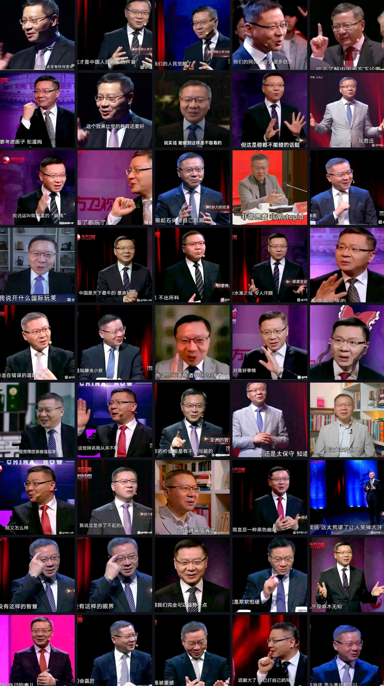

# VV

维为语录查询项目

注意：本项目仅供娱乐，请合理使用。

-----

### 项目简介

&emsp;&emsp;你还在为自己存放的VV表情包不够多，使用时觉得不够贴切而感到烦恼吗？快来试试这个项目吧！

&emsp;&emsp;本项目的python文件用于识别vv出现的视频片段（主要针对《这就是中国》节目）及对应的字幕，并输出为json文件。

### Python脚本使用说明

`requiremenets.txt`：项目包依赖，在使用本项目之前请先下载，否则可能导致项目无法正常运行。

`generate_features.py`：用于生成人脸特征数据的脚本，如果没有自己的数据集可以不用，本项目已经附带了人脸数据集。如果需要用自己的数据集训练在同级目录新建`target`文件夹，将人脸照片放入即可生成数据集文件。

`face_features.npz`：本项目附带的人脸数据集，可直接使用。

`FaceRec.py`：人脸识别文件。

`CutSubtitle.py`：针对《这就是中国》节目视频的字幕裁剪识别文件。

`main.py`：主函数，程序入口。

### Web网页端使用说明

&emsp;&emsp;访问[vv.cicada000.work](https://vv.cicada000.work/)即可直接使用网页端的台词搜索功能。在搜索框内搜索关键词即可匹配含有该关键词的台词。其中搜索框后的数字（示例图片及网页默认为98）为识别到的人脸相似度，即识别到画面中的人物和VV相似度高于98%的视频帧的台词会出现在搜索结果中。但是由于该项目的人脸识别在侧脸识别的效果不佳，OCR台词的效果也差强人意，可能会搜索不到全部的结果。

&emsp;&emsp;如果想使用精确搜索，可以输入多个词组，则会返回同时包含这几个词组的字幕台词。例如上图如果只想搜索到最精确的结果，则将“我看了都乐了”改为“我看了 都乐了”输入即可输出最匹配的一个结果。

~~上面的匹配率看个乐呵就好~~

### 未完成功能

- [ ] 提高人脸识别精度
- [ ] 改进搜索算法
- [ ] 添加视频源
- [ ] 网页端错误上报功能

### 所使用的开源项目

[ddddocr](https://github.com/sml2h3/ddddocr)