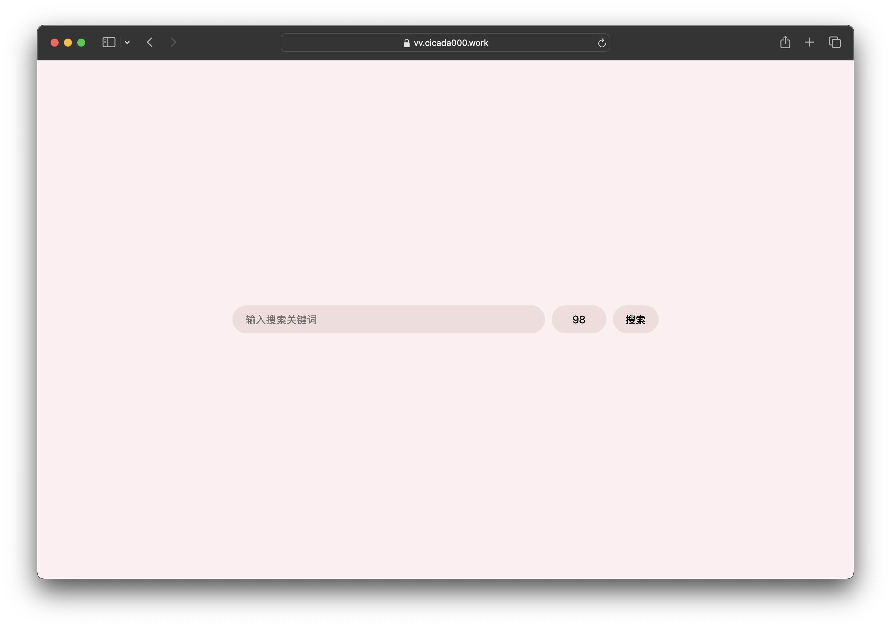
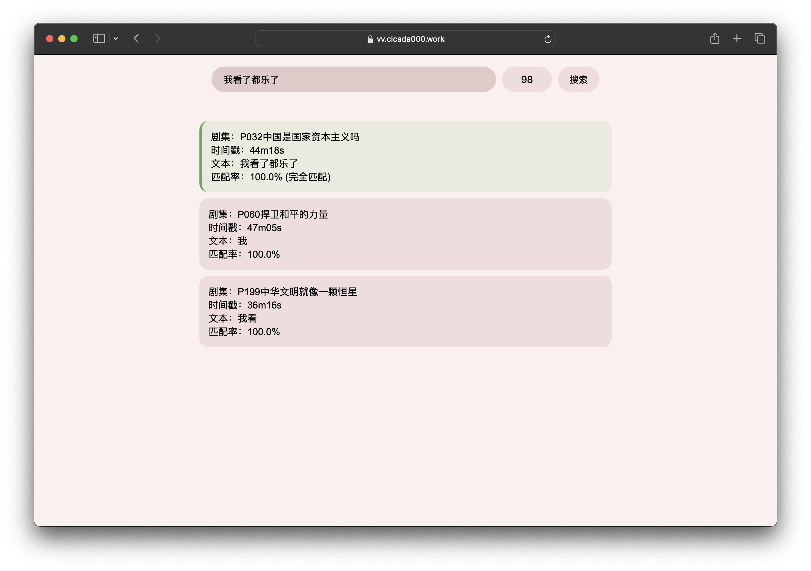

# VV

张维为语录查询项目，纯查询无需下载本项目，直接在[网页端](https://vv.cicada000.work)即可完成查询。

> [!CAUTION]
> 本项目仅供娱乐，请合理使用。

-----

## 项目简介

&emsp;&emsp;你还在为自己存放的VV表情包不够多，使用时觉得不够贴切而感到烦恼吗？快来试试这个项目吧！

<p align="center" style="margin-bottom: 0px !important;">
<br/>
</p>

<p align="center" style="margin-bottom: 0px !important;">
<br/>
</p>

&emsp;&emsp;本项目主要用于识别vv出现的视频片段（主要针对《这就是中国》节目，后续可能会增加其他视频源）及对应的字幕，并输出为json文件。

## Python脚本使用说明

### 文件基本说明

`requirements.txt`：项目包依赖，在使用本项目之前请先下载，否则可能导致项目无法正常运行。

`generate_features.py`：用于生成人脸特征数据的脚本，如果没有自己的数据集可以不用，本项目已经附带了人脸数据集，即`face_features.npz`。如果需要用自己的数据集训练在同级目录新建`target`文件夹进行训练即可。

`generate_features_insightface.py`：用于生成人脸特征数据的脚本，如果没有自己的数据集可以不用，本项目已经附带了人脸数据集，即`face_features_insightface.npz`。如果需要用自己的数据集训练在同级目录新建`target`文件夹进行训练即可。

`target`文件夹，将人脸照片放入即可生成数据集文件，为了方便起见，GitHub仓库中的target文件夹可在Release中找到，解压放入项目中即可进行人脸识别的训练，正常运行识别项目可以不需要这个文件夹。

`subtitle`：文件夹，本项目运行的人脸识别+字幕提取的json文件可以在文件夹中找到。

`face_features.npz`：本项目附带的人脸数据集，可直接使用，针对`FaceRec.py`。

`face_features_indightface.npz`：本项目附带的人脸数据集，可直接使用，针对`FaceRec_insightface.py`。

`FaceRec.py`：人脸识别脚本，使用[dlib](https://github.com/davisking/dlib)的方案。

`FaceRec_insightface.py`：使用了[insightface](https://github.com/deepinsight/insightface)的人脸识别方案，相比于`FaceRec.py`准确率更高。

`CutSubtitle.py`：针对《这就是中国》节目视频的字幕裁剪识别脚本，使用[ddddocr](https://github.com/sml2h3/ddddocr)。

`CutSubtitle_paddleocr.py`：字幕裁剪识别脚本，使用[PaddleOCR](https://github.com/PaddlePaddle/PaddleOCR)。

`main.py`：主函数，程序入口。

### 运行本项目的说明

> [!TIP]
> 如果要使用GPU进行训练，推荐使用Linux环境~~因为我Windows配半天没配好~~。笔者环境为WSL2 Ubuntu24.04 + CUDA12.8 + libcudnn9

正常使用CPU运行直接下载依赖运行即可（应该）。

如需使用GPU运行（这玩意拿纯CPU运行慢的要死），在下载相关pip库时需下载GPU版本。例如`pip install paddlepaddle`需改为`pip install paddlepaddle-gpu`，使用高版本的CUDA时，则需要下载更高版本的库，可在官网找到[下载命令](https://www.paddlepaddle.org.cn/en/install/quick?docurl=/documentation/docs/en/develop/install/pip/linux-pip_en.html)。

## Web网页端使用说明

&emsp;&emsp;访问[vv.cicada000.work](https://vv.cicada000.work/)即可直接使用网页端的台词搜索功能。在搜索框内搜索关键词即可匹配含有该关键词的台词。其中搜索框后的数字（示例图片及网页默认为98）为识别到的人脸相似度，即识别到画面中的人物和VV相似度高于98%的视频帧的台词会出现在搜索结果中。但是由于该项目的人脸识别在侧脸识别的效果不佳，OCR台词的效果也差强人意，可能会搜索不到全部的结果。

<center></center>

<center></center>

&emsp;&emsp;如果想使用精确搜索，可以输入多个词组，则会返回同时包含这几个词组的字幕台词。例如上图如果只想搜索到最精确的结果，则将“我看了都乐了”改为“我看了 都乐了”输入即可输出最匹配的一个结果。

## API使用说明

&emsp;&emsp;API具体请求示例如下：

```
https://vvapi.cicada000.work/search?query=测试&min_ratio=50&min_similarity=0.5&max_results=10
```

参数解释：

`query`：请求查询的关键词。

`min_ratio`：关键词在句子中的最小匹配度。（这一部分算法还待优化）

`min_similarity`：最小的人脸识别匹配度，一般认为0.5以上为VV。

`max_results`：返回的结果最多的个数，如果不添加默认返回全部匹配的结果。

## 未完成功能

- [x] 提高人脸识别精度
- [x] 改进搜索算法
- [x] 添加视频源
- [ ] 网页端错误上报功能（真的需要吗）

## 主要使用的开源项目

[ddddocr](https://github.com/sml2h3/ddddocr)

[PaddleOCR](https://github.com/PaddlePaddle/PaddleOCR)

[insightface](https://github.com/deepinsight/insightface)

[dlib](https://github.com/davisking/dlib)

[BBDown](https://github.com/nilaoda/BBDown)

## 致谢

&emsp;&emsp;感谢[wen999di](https://github.com/wen999di)及其提交的[PR](https://github.com/Cicada000/VV/issues?q=is%3Apr+author%3Awen999di)，大幅提高了人脸检测准确率和字幕识别准确率。感谢[undef-i](https://github.com/undef-i)及其提交的[PR](https://github.com/Cicada000/VV/issues?q=is%3Apr+author%3Aundef-i)，大幅提高了字幕检索速度，并且添加了GPU支持，大幅减少了新版本的人脸识别和字幕识别所需的时间。